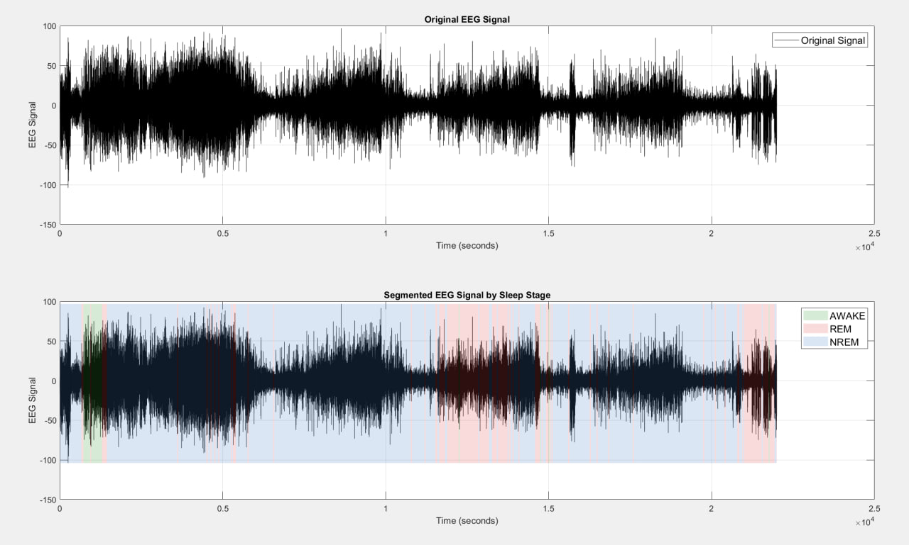

# Sleep-Stage-Detection
Semi-Supervised EEG Signal Processing for Sleep Stage Detection

## Project Overview
This project processes EEG data to identify sleep stages (AWAKE, REM, NREM) using a semi-supervised approach due to the lack of labels. It involves data loading, pre-processing, feature extraction, dimensionality reduction, and clustering.

## Key Features
- **Pre-processing**: Includes DC component removal, bandpass filtering, wavelet denoising, and re-filtering for artifact removal.
- **Feature Extraction**: Extracts time-domain and frequency-domain features.
- **Dimensionality Reduction**: PCA for feature space reduction.
- **Clustering**: Uses Gaussian Mixture Model (GMM) for unsupervised clustering of sleep stages.
- **Pre-labeling**: Implements knowledge-based rules to create initial labels for guiding the clustering process.
- **Semi-supervised Learning**: Combines pre-labeled data segments with unsupervised GMM clustering to improve sleep stage identification.
- **Visualization**: Plots original and processed signals, FFT, PSD, histograms, and hypnograms.

## Dataset
The project uses an EEG dataset (without labels) stored in a `.mat` file (`data.mat`), containing EEG signals sampled at a specific rate, which are processed to microvolts and prepared for analysis.

## Methodology
1. **Data Loading and Pre-processing**
   - Load EEG data from `data.mat`.
   - Apply bandpass filtering (1-40 Hz).
   - Perform wavelet denoising using 'db8' wavelet.
   - Remove artifacts with a secondary bandpass filter.

2. **Feature Extraction**
   - Time-domain features: skewness, zero-crossing rate.
   - Frequency-domain features: band power, skewness, kurtosis, peak frequency, and power ratio across Delta, Theta, Alpha, Sigma, Beta bands using Welch’s method.

3. **Dimensionality Reduction**
   - Apply PCA to reduce features, retaining 98% explained variance.

4. **Pre-labeling and Clustering**
   - Apply knowledge-based empirical rules to pre-label data segments.
   - Use pre-labeled segments to guide the unsupervised GMM clustering, enabling a semi-supervised approach to identify sleep stages.

## Results
- Visual outputs include:
  - Original and denoised EEG plots.
  - FFT and PSD analysis.
  - Histograms of feature distributions.
  - Hypnogram representing segmented EEG data.

## Setup and Usage
### Prerequisites
- MATLAB with Signal Processing and Statistics toolboxes.

### Running the Code
1. Load `data.mat` in your MATLAB workspace.
2. Run the script step-by-step to view plots and results.
3. Save outputs in an `outputs/` folder for organized results storage.

## References
1. Huang, C.-S., et al. (2014). *Knowledge-based identification of sleep stages based on two forehead electroencephalogram channels*. [Frontiers in Neuroscience](http://www.frontiersin.org)
2. Dement, W., & Kleitman, N. (1957). *Cyclic variations in EEG during sleep and their relation to eye movements, body motility, and dreaming*. Electroencephalography and Clinical Neurophysiology, 9(4), 673-690.